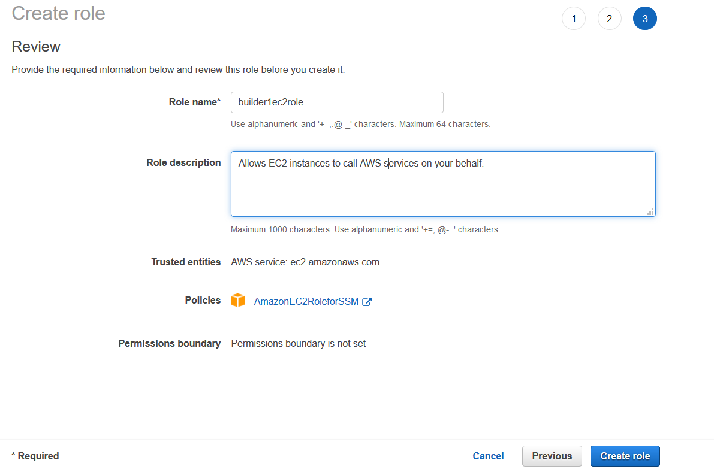
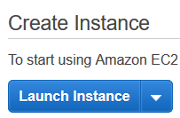

# reinvent2018-ssm-automation

Here be automations

### Safely and securely perform disruptive tasks at scale

### Description
Use either **AWS-RestartEC2Instance, AWS-StopEC2Instance or AWS-StartEC2Instance** Automation document to target an AWS Resource Group that includes multiple instances. The Automation workflow must be configured to use rate controls. 

### Prerequisites

- IAM Instance profiles
- Amazon EC2 Instance(s)
- Resource Group

### Create an IAM instance profile for Systems Manager managed instances
By default, Systems Manager doesn't have permission to perform actions on your instances. You must grant access by using an IAM instance profile. Complete the following steps to create an IAM instance profile role with Systems Manager permissions.

1.	Open the IAM console at https://console.aws.amazon.com/iam/.

2.	In the navigation pane, choose **Roles**, and then choose Create **role**.

3.	On the Select type of trusted entity page, under AWS Service, choose **EC2**, and then choose **Next: Permissions**.

4.	On the Attached permissions policy page, find and add **AmazonEC2RoleforSSM** policy, and then choose **Next: Review**.

5.	On the Review page, type a name in the Role name box, and optionally type a description. Then choose **Create role**. In the example below role name is **builder1ec2role**.

### To create an instance that uses the Systems Manager instance profile
Ensure you have at least two Amazon EC2 instances.	

1.	Open the Amazon EC2 console at https://console.aws.amazon.com/ec2/.

2.	Choose **Launch Instance**.

3.	On the **Choose an Amazon Machine Image (AMI)** page, locate the AMI for the instance type you want to create, and then choose **Select**. In the example I selected **Microsoft Windows Server 2016 Base**.

4.	Choose **Next: Configure Instance Details**.

5.	On the **Configure Instance Details** page, in the IAM role drop-down list, choose the instance profile you previously created, in the example the instance profile is **builder1ec2role**. Then choose **Next: Add Storage**.

6.	Choose **Next: Add Tags**.

7.	On the **Add Tags** page, choose **Add Tag**.

8.	Fill in the **Key** and **Value** for your tag. In the example, Key is set to **environment** and Value set to **builder1**.

9.	Complete the remaining steps in the wizard.

### Create a Resource Group

1.	Open the AWS Systems Manager console at https://console.aws.amazon.com/systems-manager/.
2.	In the left navigation pane, under **Resource Groups**, choose **Saved Resource Group**.
3.	In the menu bar, choose **Create resource group**.
4.	In the dropdown list for **Select resource types**, choose **AWS::EC2::Instance**.
5.	Type in the Tag key and value of the tag created on the EC2 Managed Instance. In the example, Tag key is **environment** and value is **builder**. Choose the **+** button to add the tag.
6.	In the **Group details** section, fill in the Group name, in my example Group name is **Builder1-AllManagedEC2Instances**. 
7.	Choose **Create group**.

### Execute Automation Document

1.	Open the AWS Systems Manager console at https://console.aws.amazon.com/systems-manager/ .
2.	In the left navigation pane, choose **Automation**.
3.	On the menu bar, choose **Execute Automation**.
4.	In the Automation document list, Use either the Search bar or the numbers to the right of the Search bar to find the Automation document named **AWS-RestartEC2Instance**.
5.	Select the Automation document **AWS-RestartEC2Instance**. Then, under **Document details**, select **Default version at runtime** as the Document version and under **Execution Mode**, select **Execute the entire automation at once**. 
6.	In the Targets and Rate Control section, choose **Enable targets and rate control**.
7.	Under Targets, for Targets select **Resource Group**, for Parameter select **InstanceId**, and then for Resource Group select the **Resource Group** you created as part of the prerequisites. 
8.	Under **Concurrency**, select to **1** target at a given time. 
9.	Under **Error threshold**, select percentage, then **100**.
10.	Now we ready to run the Automation document, choose **Execute Automation**.
11.	You should now see, Automation execution has been initiated and in progress. 
12.	Automation execution has successfully completed. 
